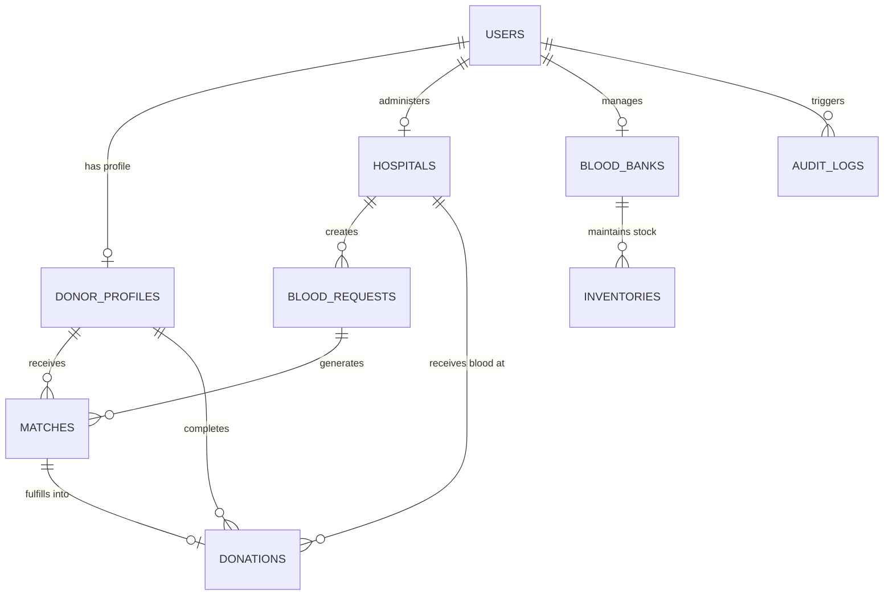

# Database Specification & Schema Design (DATABASE)

## Project Name: Blood Donation Network (BDN)
**Engine:** PostgreSQL 16 + PostGIS Spatial Extension  
**ORM:** Prisma ORM v5  
**Document Version:** 1.0.0  

---

## 1. Entity Relationship Overview

The BDN relational schema centers around four core domain clusters:
1. **User & Identity Management:** `users`, `donor_profiles`, `hospitals`, `blood_banks`.
2. **Blood Requests & Dispatch:** `blood_requests`, `matches`, `donations`.
3. **Inventory Management:** `inventories`, `inventory_batches`.
4. **Compliance & Audit:** `audit_logs`, `notification_logs`.

### Mermaid Entity Relationship Diagram (ERD)



---

## 2. Table Schemas & Constraints (Prisma DDL Format)

```prisma
datasource db {
  provider   = "postgresql"
  url        = env("DATABASE_URL")
  extensions = [postgis]
}

generator client {
  provider        = "prisma-client-js"
  previewFeatures = ["postgresqlExtensions"]
}

enum Role {
  DONOR
  HOSPITAL_ADMIN
  BLOOD_BANK_MANAGER
  SYSTEM_ADMIN
}

enum BloodGroup {
  A_POSITIVE
  A_NEGATIVE
  B_POSITIVE
  B_NEGATIVE
  AB_POSITIVE
  AB_NEGATIVE
  O_POSITIVE
  O_NEGATIVE
}

enum ComponentType {
  WHOLE_BLOOD
  PACKED_RED_BLOOD_CELLS
  PLATELETS
  FRESH_FROZEN_PLASMA
  CRYOPRECIPITATE
}

enum RequestUrgency {
  ROUTINE
  URGENT
  CRITICAL
}

enum RequestStatus {
  SEARCHING
  PARTIALLY_MATCHED
  FULFILLED
  CANCELLED
  EXPIRED
}

enum MatchStatus {
  NOTIFIED
  ACCEPTED
  DECLINED
  EXPIRED
  COMPLETED
}

model User {
  id            String   @id @default(uuid()) @db.Uuid
  email         String   @unique @db.VarChar(255)
  passwordHash  String   @map("password_hash") @db.VarChar(255)
  role          Role     @default(DONOR)
  isVerified    Boolean  @default(false) @map("is_verified")
  createdAt     DateTime @default(now()) @map("created_at")
  updatedAt     DateTime @updatedAt @map("updated_at")

  donorProfile  DonorProfile?
  hospital      Hospital?
  bloodBank     BloodBank?
  auditLogs     AuditLog[]

  @@map("users")
}

model DonorProfile {
  id                 String     @id @default(uuid()) @db.Uuid
  userId             String     @unique @map("user_id") @db.Uuid
  fullName           String     @map("full_name") @db.VarChar(150)
  phone              String     @unique @db.VarChar(20)
  bloodGroup         BloodGroup @map("blood_group")
  dateOfBirth        DateTime   @map("date_of_birth") @db.Date
  weightKg           Decimal    @map("weight_kg") @db.Decimal(5, 2)
  isAvailable        Boolean    @default(true) @map("is_available")
  lastDonationDate   DateTime?  @map("last_donation_date") @db.Date
  nextEligibleDate   DateTime   @map("next_eligible_date") @db.Date
  latitude           Float
  longitude          Float

  user               User       @relation(fields: [userId], references: [id], onDelete: Cascade)
  matches            Match[]
  donations          Donation[]

  @@index([bloodGroup, isAvailable, nextEligibleDate])
  @@map("donor_profiles")
}

model Hospital {
  id              String   @id @default(uuid()) @db.Uuid
  userId          String   @unique @map("user_id") @db.Uuid
  name            String   @db.VarChar(200)
  licenseNumber   String   @unique @map("license_number") @db.VarChar(100)
  phone           String   @db.VarChar(20)
  address         String   @db.Text
  latitude        Float
  longitude       Float
  isApproved      Boolean  @default(false) @map("is_approved")
  createdAt       DateTime @default(now()) @map("created_at")

  user            User           @relation(fields: [userId], references: [id], onDelete: Cascade)
  requests        BloodRequest[]
  donations       Donation[]

  @@map("hospitals")
}

model BloodBank {
  id              String   @id @default(uuid()) @db.Uuid
  userId          String   @unique @map("user_id") @db.Uuid
  name            String   @db.VarChar(200)
  licenseNumber   String   @unique @map("license_number") @db.VarChar(100)
  phone           String   @db.VarChar(20)
  address         String   @db.Text
  latitude        Float
  longitude       Float
  createdAt       DateTime @default(now()) @map("created_at")

  user            User        @relation(fields: [userId], references: [id], onDelete: Cascade)
  inventories     Inventory[]

  @@map("blood_banks")
}

model BloodRequest {
  id             String         @id @default(uuid()) @db.Uuid
  hospitalId     String         @map("hospital_id") @db.Uuid
  bloodGroup     BloodGroup     @map("blood_group")
  componentType  ComponentType  @map("component_type")
  unitsRequested Int            @map("units_requested")
  unitsFulfilled Int            @default(0) @map("units_fulfilled")
  urgency        RequestUrgency @default(ROUTINE)
  status         RequestStatus  @default(SEARCHING)
  requiredBy     DateTime       @map("required_by")
  notes          String?        @db.Text
  createdAt      DateTime       @default(now()) @map("created_at")
  updatedAt      DateTime       @updatedAt @map("updated_at")

  hospital       Hospital       @relation(fields: [hospitalId], references: [id])
  matches        Match[]

  @@index([status, urgency, bloodGroup])
  @@map("blood_requests")
}

model Match {
  id             String      @id @default(uuid()) @db.Uuid
  requestId      String      @map("request_id") @db.Uuid
  donorId        String      @map("donor_id") @db.Uuid
  status         MatchStatus @default(NOTIFIED)
  distanceMeters Float       @map("distance_meters")
  notifiedAt     DateTime    @default(now()) @map("notified_at")
  respondedAt    DateTime?   @map("responded_at")

  request        BloodRequest @relation(fields: [requestId], references: [id], onDelete: Cascade)
  donor          DonorProfile @relation(fields: [donorId], references: [id])
  donation       Donation?

  @@unique([requestId, donorId])
  @@map("matches")
}

model Donation {
  id             String   @id @default(uuid()) @db.Uuid
  matchId        String   @unique @map("match_id") @db.Uuid
  donorId        String   @map("donor_id") @db.Uuid
  hospitalId     String   @map("hospital_id") @db.Uuid
  unitsDonated   Int      @default(1) @map("units_donated")
  completedAt    DateTime @default(now()) @map("completed_at")
  remarks        String?  @db.Text

  match          Match        @relation(fields: [matchId], references: [id])
  donor          DonorProfile @relation(fields: [donorId], references: [id])
  hospital       Hospital     @relation(fields: [hospitalId], references: [id])

  @@map("donations")
}

model Inventory {
  id             String        @id @default(uuid()) @db.Uuid
  bloodBankId    String        @map("blood_bank_id") @db.Uuid
  bloodGroup     BloodGroup    @map("blood_group")
  componentType  ComponentType @map("component_type")
  unitsAvailable Int           @default(0) @map("units_available")
  expiryDate     DateTime      @map("expiry_date") @db.Date
  updatedAt      DateTime      @updatedAt @map("updated_at")

  bloodBank      BloodBank     @relation(fields: [bloodBankId], references: [id])

  @@unique([bloodBankId, bloodGroup, componentType, expiryDate])
  @@map("inventories")
}

model AuditLog {
  id        String   @id @default(uuid()) @db.Uuid
  userId    String?  @map("user_id") @db.Uuid
  action    String   @db.VarChar(100)
  entity    String   @db.VarChar(100)
  entityId  String   @map("entity_id") @db.VarChar(100)
  details   Json
  ipAddress String   @map("ip_address") @db.VarChar(45)
  createdAt DateTime @default(now()) @map("created_at")

  user      User?    @relation(fields: [userId], references: [id])

  @@index([action, entity])
  @@map("audit_logs")
}
```

---

## 3. PostGIS Native Spatial Indexing Strategy

In addition to relational columns, PostGIS geometry columns are applied via a custom SQL migration script:

```sql
-- Enable PostGIS Extension
CREATE EXTENSION IF NOT EXISTS postgis;

-- Add GEOMETRY(Point, 4326) columns for Spatial Distance Calculations
ALTER TABLE donor_profiles ADD COLUMN location GEOMETRY(Point, 4326);
ALTER TABLE hospitals ADD COLUMN location GEOMETRY(Point, 4326);
ALTER TABLE blood_banks ADD COLUMN location GEOMETRY(Point, 4326);

-- Create Spatial GIST Indexes
CREATE INDEX donor_profiles_location_idx ON donor_profiles USING GIST (location);
CREATE INDEX hospitals_location_idx ON hospitals USING GIST (location);
CREATE INDEX blood_banks_location_idx ON blood_banks USING GIST (location);

-- Trigger to Automatically Populate Spatial Location from Lat/Long on Insert/Update
CREATE OR REPLACE FUNCTION update_spatial_location()
RETURNS TRIGGER AS $$
BEGIN
    NEW.location = ST_SetSRID(ST_MakePoint(NEW.longitude, NEW.latitude), 4326);
    RETURN NEW;
END;
$$ LANGUAGE plpgsql;

CREATE TRIGGER trg_donor_location_update
BEFORE INSERT OR UPDATE OF latitude, longitude ON donor_profiles
FOR EACH ROW EXECUTE FUNCTION update_spatial_location();

CREATE TRIGGER trg_hospital_location_update
BEFORE INSERT OR UPDATE OF latitude, longitude ON hospitals
FOR EACH ROW EXECUTE FUNCTION update_spatial_location();
```

---

## 4. Seed Data Plan

The `prisma/seed.ts` script populates realistic initial data for development:
- **1 System Admin Account:** (`admin@bdn.org`)
- **2 Approved Hospitals:** St. Jude Emergency Center (`37.7749, -122.4194`) and City General Hospital (`37.7833, -122.4167`).
- **1 Pending Unapproved Hospital:** Mercy Clinic (`37.7500, -122.4000`).
- **1 Regional Blood Bank:** Bay Area Blood Repository (`37.7600, -122.4200`) with 50 units of assorted inventory.
- **10 Voluntary Donors:** Distributed across San Francisco coordinates with varying blood types (O-, A+, AB+, B-) and eligibility dates.
