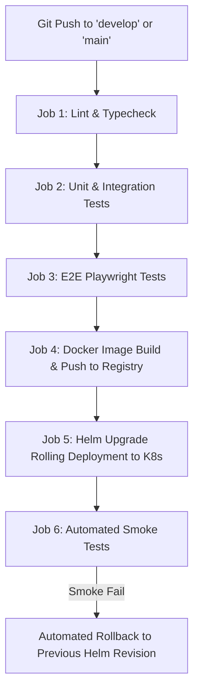

# DevOps & CI/CD Deployment Architecture (docs/devops-blueprint)

## Project Name: Blood Donation Network (BDN)
**Containerization:** Docker Compose / Kubernetes Helm  
**CI/CD Pipeline:** GitHub Actions  
**Document Version:** 2.0.0  

---

## 1. Environments Strategy

| Environment | Purpose | Database | Deployment Host |
| :--- | :--- | :--- | :--- |
| **Development** | Local engineering iteration | SQLite / Local PostgreSQL | Docker Compose on local dev host |
| **Staging** | QA, E2E testing, PR preview | AWS RDS PostgreSQL Staging | K8s Staging Cluster |
| **Production** | Live clinical coordination | AWS RDS PostgreSQL Multi-AZ | K8s Production Cluster |

---

## 2. GitHub Actions CI/CD Pipeline Flow



---

## 3. Production Rollback Strategy

1. **Kubernetes Rolling Restart:** Deployment configured with `maxSurge: 25%` and `maxUnavailable: 0` for zero-downtime releases.
2. **Instant Automated Rollback:** If automated smoke tests fail post-deploy, GitHub Actions executes:
   ```bash
   helm rollback bdn-production <previous_revision>
   ```
