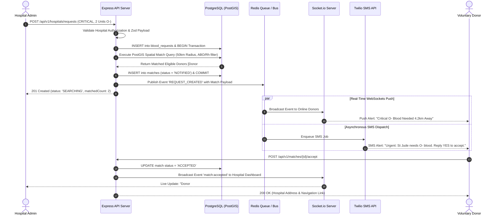
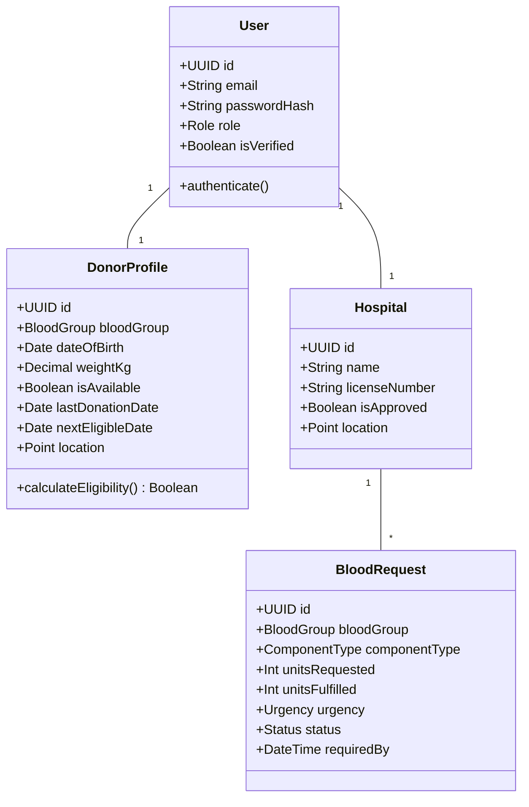

# System Architecture & Sequence Diagrams (docs/diagrams)

## Project Name: Blood Donation Network (BDN)
**Document Version:** 1.0.0  

---

## 1. System Sequence Diagram: Emergency Blood Request & Donor Matching

---

## 2. Component Class Diagram

