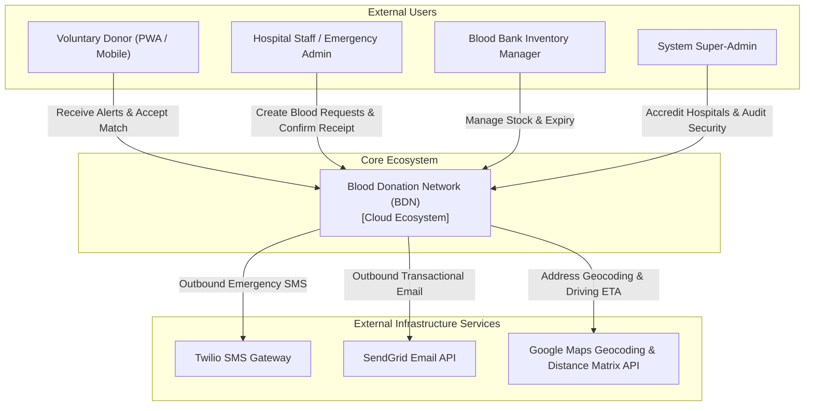
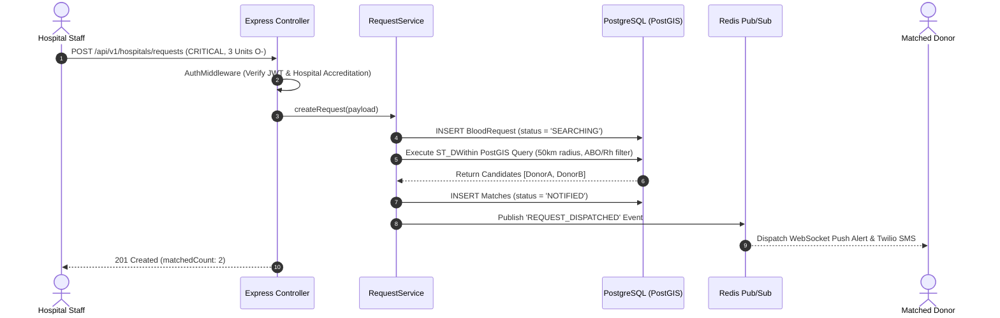

# System Design & C4 Architecture Blueprint (docs/system-design)

## Project Name: Blood Donation Network (BDN)
**Document Version:** 2.0.0  
**Architectural Standard:** C4 Model (Context, Container, Component, Code)  

---

## 1. C4 System Context Diagram (Level 1)

The C4 System Context diagram illustrates how external users (Donors, Hospital Staff, Blood Bank Managers, Administrators) and external cloud infrastructure interact with the central Blood Donation Network ecosystem.



---

## 2. C4 Container Diagram (Level 2)

The C4 Container diagram shows the high-level technology choices, container boundaries, and communication protocols.

```
+-----------------------------------------------------------------------------------------+
|                                     CLIENT BROWSER / PWA                                |
|   Next.js 14 App Router | React Client Components | Tailwind CSS | TanStack Query       |
+--------------------------------------------+--------------------------------------------+
                                             |
                                             | HTTPS / WebSockets (TLS 1.3)
                                             v
+-----------------------------------------------------------------------------------------+
|                                    APPLICATION LAYER                                    |
|   Express.js API Server (Node.js 20 LTS TypeScript) | Socket.io Real-Time Event Hub     |
+---------------------+----------------------+----------------------+---------------------+
                      |                      |                      |
      PostgreSQL Wire |                      | Redis Protocol       | HTTPS REST API
      v               v                      v                      v
+-----------------------+          +-------------------+     +----------------------------+
|  POSTGRESQL 16 (DB)   |          |    REDIS 7.2     |     |   EXTERNAL INTEGRATIONS    |
| • PostGIS Extensions  |          | • Token Blacklist |     | • Twilio SMS API           |
| • Relational Tables   |          | • Rate Limiting   |     | • SendGrid Transactional   |
| • Audit Log History   |          | • BullMQ Queues   |     | • Google Maps Distance API |
+-----------------------+          +-------------------+     +----------------------------+
```

---

## 3. C4 Component Diagram: Backend Application Container (Level 3)

Inside the Express.js API Server container, dependencies flow strictly inwards through 5 layers:

```
[ HTTP Router & Transport ] 
           |
           v
[ Middleware Layer ] (AuthMiddleware, ValidateMiddleware, RateLimitMiddleware)
           |
           v
[ Application / Controller Layer ] (AuthControl, RequestControl, DonorControl, AdminControl)
           |
           v
[ Domain Service Layer ] (AuthService, RequestService, DonorService, AuditService)
           |
           +-----------------------+-----------------------+
           |                       |                       |
           v                       v                       v
[ Persistence Layer ]     [ Infrastructure Layer ] [ Integration Layer ]
 (Prisma ORM / PostGIS)    (Winston Logger / Redis)  (Twilio / SendGrid Adapter)
```

---

## 4. C4 Deployment Diagram (Level 4 - Kubernetes Infrastructure)

```
[ Cloud Load Balancer (AWS ALB / NGINX Ingress) ]
                     |
                     +-----------------------+
                     |                       |
                     v                       v
          [ Node 1: API Pod ]       [ Node 2: API Pod ]
          • Express Server          • Express Server
          • Socket.io Client        • Socket.io Client
                     |                       |
                     +-----------+-----------+
                                 |
                                 v
          +----------------------+----------------------+
          |                                             |
          v                                             v
[ PostgreSQL Primary (ACID DB) ]              [ Redis Cluster ]
• PostGIS Spatial Index                       • BullMQ Queue Store
• Write-Ahead Logs (WAL)                      • Session & Rate Limits
```

---

## 5. End-to-End Workflow Sequence Diagrams

### 5.1 Request Creation & Spatial Matching Sequence Diagram


---

### 5.2 Failure & Recovery Flow Diagram

```
[ Request Creation Attempt ]
             |
             v
    { DB Available? }
      /           \
    YES            NO
    /               \
   v                 v
[ Save Request ]   [ Failover: Write to Redis Dead-Letter Buffer ]
   |                 |
   v                 v
[ Execute Match ]  [ Worker Retries DB Connection (Exponential Backoff) ]
   |                 |
   v                 v
[ Send Alert ]     [ Flush Buffer to DB once reconnected ]
```

### Recovery & Retry Parameters:
- **Notification Retry:** BullMQ worker executes up to 3 retries for Twilio SMS dispatches with exponential backoff (`delay = 2^attempt * 1000ms`).
- **Database Connection Re-Establishment:** Prisma automatically handles connection pool reconnects up to 10 seconds before raising a `503 Service Unavailable` RFC 7807 problem detail response.
